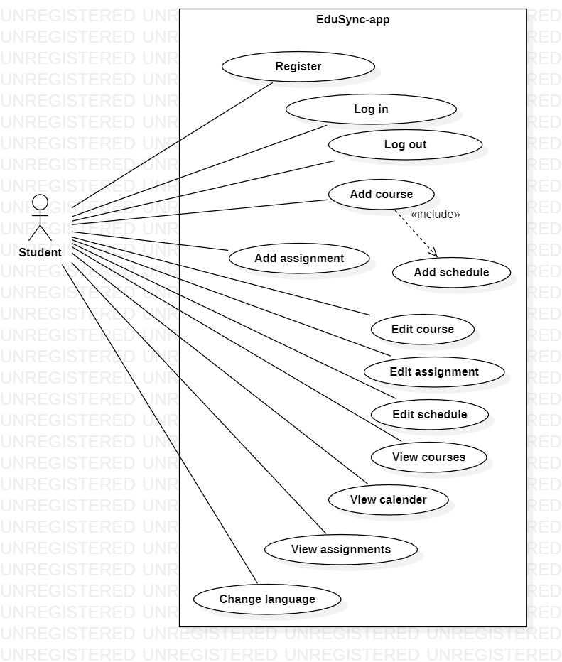
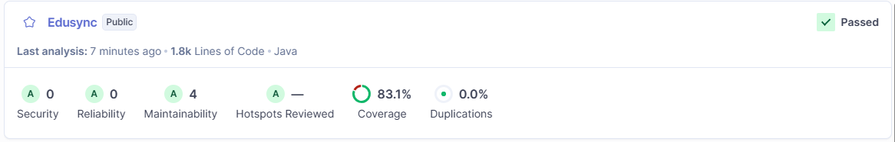
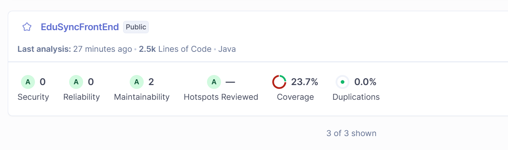

# EduSync
This is the Software Engineering Project 1 in Metropolia UAS course. The purpose of this project is to use
agile software development methods to create a software product for study planning. The main features are:
- Create and track study plans
- Assignment deadlines
- Class schedules
- Reminders
- Three languages: English, Arabic, Ukrainian

---

## Team Members
Aaro Jylhämäki, Juhana Hänninen, Leevi Rinnetmäki, Nea Lukumies

---

## Technologies Used
The following technologies were chosen for their relevance to the course and their suitability
for building, managing and deploying the application:
- Java, JavaFX
- Maven
- MariaDB
- Jenkins
- Docker
- Kubernetes
- Github
- Resource bundles for localisation

---

## Requirements
- Java 17 or higher
- Maven
- Docker (for containerization)
- MariaDB
- (Optional) An IDE such as IntelliJ IDEA
- Jenkins (for CI/CD)

---

## Jenkins
The project uses Jenkins for continuous integration and continuous deployment (CI/CD). 
The Jenkins pipeline is defined in the Jenkinsfile located in the root directory of the project. 
The pipeline includes stages for building, testing, and deploying the application. 
It also generates code coverage reports using JaCoCo.

---

## Use Case Diagram


This use case diagram illustrates the main functionalities available to students using the EduSync application. 
A student can register, log in and out as needed. Once logged in, the student can add courses to their course list,
assign schedules to those courses and create assignments for those courses. They can also modify their courses, tasks
and schedules. Student can view their schedule through the calendar view. The language of the application can be changed
at any time.

---

## How to Run Locally
Before running the application, start the backend service. Follow the instructions in the backend repository: [EduSync Backend](https://github.com/nealukumies/edusync-backend/)

To run the frontend application locally, follow these steps:
### Using an IDE:
1. Clone the repository.
2. Open the project in your preferred Java IDE (e.g., IntelliJ IDEA).
3. Compile the project using your IDE`s build tools or Maven.
4. Run the `Main` class in the layout_model package to start the application.
5. The application window will open, and you can start using the app.

### Using Command Line:
1. Clone the repository.
2. Navigate to the project directory:
   ```bash
   cd edusync
   ```
3. Compile the project using Maven:
   ```bash
      mvn clean install
    ```
4. Run the application using the following command:
5.   ```bash
      java -jar target/edusync-client.jar
      ```
6. The application window will open, and you can start using the app.

### Using Docker:
1. Ensure Docker is installed and running on your machine.
2. Clone the repository.
3. Navigate to the project directory:
   ```bash
   cd edusync
   ```
4. Build the Docker image using Docker compose:
   ```bash
   docker compose up --build
   ```
The application window will open, and you can start using the app.

5. To stop the application, press `Ctrl + C` in the terminal where Docker is running or use:
   ```bash
   docker compose down
   ```

---

## Localisation
The application supports three languages: English, Arabic, and Ukrainian. Default language is set to English.
To change the language, select your preferred language from the combobox in the header of the application.
The application will update the UI text accordingly as well as RTL/LTR layout based on the selected language.

The application is localized using Java Resource Bundles for each supported language. Translations were done with Google Translate and may not be perfect
as it is suggested to have a native speaker review them for accuracy. Localisation files are located in the `resources/Resource Bundle 'Messages'` directory as
separate properties files for each language:
- Messages_en_US.properties (English)
- Messages_ar_DZ.properties (Arabic)
- Messages_uk_UA.properties (Ukrainian)

The acceptance criteria for localization includes:
- The default language is English.
- Users can select Arabic and Ukrainian from the language selection combobox.
- All UI text is translated into the supported languages immediately after selecting the language.
- The layout adjusts correctly for RTL languages.
- Users can switch languages seamlessly without restarting the application.

These criteria were tested manually by switching languages and verifying the translations and layout adjustments.

Database localisation:

The system is primarily driven by user input and therefore static content translations are handled at the frontend.

- The database is configured to use UTF-8 encoding, which allows storage of text in multiple languages (including English, Arabic and Ukrainian).
- All tables and columns that store user input support UTF-8 characters.
- Users can enter content in the available languages and it is stored in the database correctly.
- The application does not have static content that requires localization.
- To avoid unnecessary duplication of static content, all UI enums (Weekday, Status) that represent fixed options are translated in the frontend using Resource Bundles.
- The application was tested by saving and retrieving Arabic and Ukrainian text.

---

## Code Quality
The project team conducted code review of both frontend and backend code using CheckStyle, PMD, Spotbugs and SonarQube. The objective
of this assessment was to evaluate code quality, maintainability and adherence to best practices. A Code Review Report was written
to document the findings and recommendations for improvement. The report can be found in the `doc` folder as `CodeReviewReport.pdf`.

### Sonar Qube Analysis
The following image shows the SonarQube analysis results for backend code quality.



The following image shows the SonarQube analysis results for frontend code quality.



---

## Testing
The application underwent both functional and non-functional testing.
- Functional testing: Manual tests, user acceptance test and heuristic evaluation
- Error handling: NullPointerExceptions were detected and fixed
- Integration testing: Manual and non-functional tests confirmed smooth integration between frontend and backend services
- Unit testing: Backend unit tests achieved 83% code coverage, necessary frontend features were unit-tested and JavaFX components were tested manually
- Performance testing: JMeter tests using both local and external databases showed stable response times, good throughput and confirmed that the system performs best with a local database setup.
  
